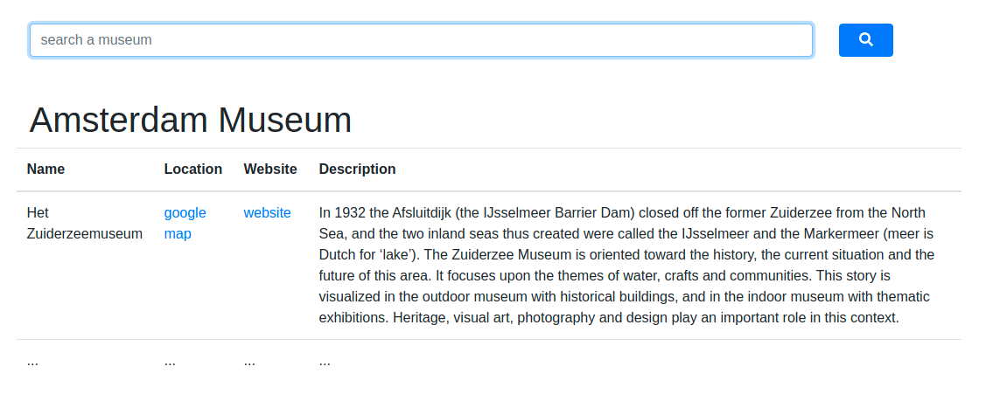

[](https://travis-ci.org/FabienArcellier/blueprint-webapp-flask)

## Motivation

Le but de ce repository est d'implémenter un moteur de recherche
de musée.



1. Implémenter le chargement du fichier `data/MuseaGalleries.json` dans `app/webapp.py`

    a. inspirez vous de cette commande : https://github.com/Esme-Sudria-Database/dojo_elasticsearch/blob/master/import_es_musea_galleries

```bash
make import_data
```

2. Implémenter la recherche dans `app/webapp.py`

    a. information à propos du sdk : https://elasticsearch-py.readthedocs.io/en/master/#example-usage

```bash
make server_run
```

## Getting started

```bash
make venv
make install_requirements_dev
make server_run
```

## The latest version

You can find the latest version to ...

```bash
git clone ...
```

## Usage

1. import the data in elasticsearch

```bash
make import_data
```

1. load the webserver

```python
make server_run
```

## Contributing

### Install development environment

Use make to instanciate a python virtual environment in ./venv3 and install the
python dependencies.

```bash
make venv
make install_requirements_dev
```

### Freeze the library requirements

If you want to freeze all the packages, use
this procedure

```bash
make freeze_requirements
```

### Activate the python environment

When you setup the requirements, a `venv3` directory on python 3 is created.
To activate the venv, you have to execute /

```bash
source venv/bin/activate
```

### Run the linter and the unit tests

Before commit or send a pull request, you have to execute pylint to check the syntax
of your code and run the unit tests to validate the behavior.

```bash
make lint
make tests
```

## Contributors

* Fabien Arcellier

## License

A short snippet describing the license (MIT, Apache, etc.)
